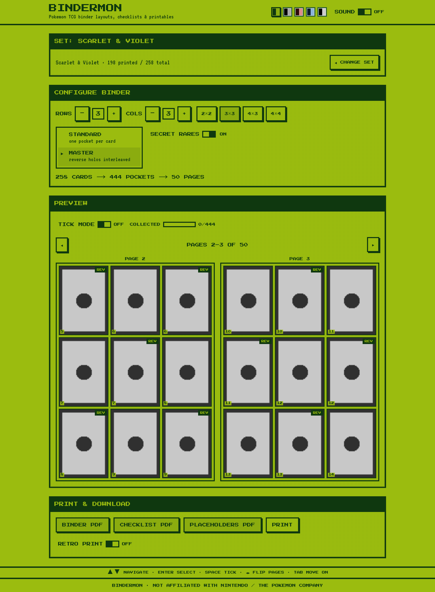
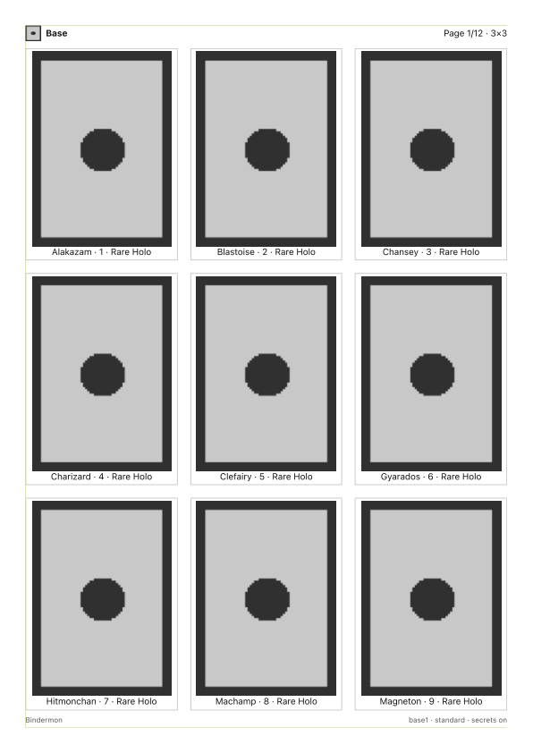

# Nomekop

Pokemon TCG binder layouts, checklists and printables — wrapped in an original
Game Boy aesthetic.

Pick any set, choose your binder grid (1–5 × 1–5), optionally interleave
reverse-holo parallels (master set), tick off what you've collected, and print
A4 PDFs: binder pages, a checklist, and true-size pocket placeholders.



## Features

- **Every set** from the Pokemon TCG API, searchable and grouped by series
- **Binder-size presets** (4/9/12/16 pockets, 12-pocket default) plus a custom grid; holo prints get badges and a pixel shimmer; a **binder shelf** suggests matching Vault X binders
- **Master set mode** — reverse holos interleaved next to their base card,
  detected from price data with an era/rarity fallback; **ball-pattern sets**
  (Prismatic Evolutions, Black Bolt, White Flare) gain Poké Ball / Master Ball
  toggles and interleaved-or-at-end placement
- **Secret rares toggle** (numbers beyond the printed total and TG/GG subsets)
- **Binder preview** as facing-page spreads with page-flip navigation
- **Collection mode** persisted locally (no accounts): pokeball fly-in animation,
  prominent collected marks, HP-bar progress, **CSV export** with a collected column
- **Three printables**, identical in browser print and PDF download:
  binder pages · checklist · cut-out placeholders (with crop marks)
- **Five Game Boy palettes** (DMG, Pocket, Kanto Red, Cerulean, High Contrast)
  — every pairing WCAG AA, enforced by tests
- **Keyboard-first**: d-pad style menus, roving focus, the blinking ▶ cursor is
  the focus indicator; fully usable without a pointer
- **Optional 8-bit sound** (off by default) and animations that respect
  `prefers-reduced-motion`



## Quickstart

```bash
pnpm install
pnpm dev            # live data from pokemontcg.io (no key needed)
```

Offline demo mode (only Base Set + Scarlet & Violet, no network):

```bash
TCG_DATA_SOURCE=fixture pnpm dev
```

An API key (free, [dev.pokemontcg.io](https://dev.pokemontcg.io)) raises rate
limits — put it in `.env` as `POKEMONTCG_API_KEY`. See `.env.example` for all
options.

## Docker

```bash
docker compose up --build
# → http://localhost:3000
```

The image bundles system Chromium for the PDF pipeline and persists the API
cache in a named volume.

## Scripts

| Command      | What it does                                     |
| ------------ | ------------------------------------------------ |
| `pnpm dev`   | dev server                                       |
| `pnpm build` | production build (`STANDALONE=1` for Docker)     |
| `pnpm start` | serve the production build                       |
| `pnpm test`  | unit + component tests (Vitest, RTL, vitest-axe) |
| `pnpm e2e`   | Playwright suite (run `pnpm build` first)        |
| `pnpm check` | lint + typecheck + unit tests                    |

## Architecture

```
app/                  Next.js App Router
  api/sets            cached set list
  api/cards/[setId]   cached cards per set
  api/img             allowlisted caching image proxy (PDF hermeticity)
  api/pdf             Puppeteer renders /print/* to A4 (p-limit 3, retry, rate limit)
  print/{binder,checklist,placeholders}   A4 print views (browser-printable too)
components/gb/        the Game Boy design system (listbox menus, dialog boxes,
                      HP bars, spinners — accessible semantics underneath)
lib/layout/           pure layout engine: collector-number sort, variant
                      interleaving, pagination into pages/spreads
lib/tcg/              CardDataSource: pokemontcg.io client or committed fixtures
lib/server-store.ts   SQLite (node:sqlite) cache: sets 24h, cards+prices 12h, SWR
lib/tcg/refresh.ts    daily background walk of every set (instrumentation.ts)
```

The same React components render the on-screen preview, the print routes and
the PDFs — one layout engine, three outputs.

## Accessibility

WCAG 2.2 AA is a tested requirement: palette contrast is computed in unit
tests, axe runs against every theme in CI (component level and full-page in a
real browser), the complete flow works keyboard-only, and all motion collapses
under `prefers-reduced-motion`. Found a gap? Please open an issue.

## Testing

~170 unit/component tests (Vitest + Testing Library + vitest-axe) and a
Playwright suite covering the happy path, keyboard-only use, five-theme axe
sweeps, reduced motion, print routes and PDF page-count verification against
the layout engine. Fixtures are real captured API responses, so everything
runs offline and deterministically.

## Credits

Card data and images from the [Pokemon TCG API](https://pokemontcg.io).
Nomekop is a fan-made tool, not affiliated with Nintendo, Game Freak or The
Pokemon Company.
